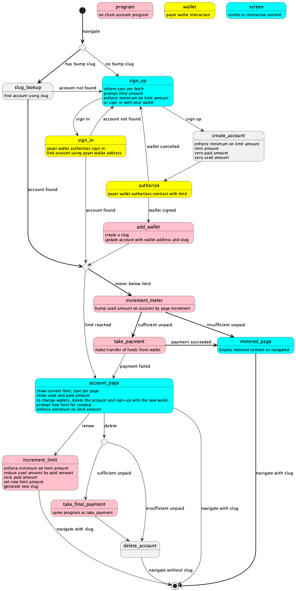

# SolPay

This project offers a pay-as-you-go capability using the Solana
block chain ecosystem.

- https://docs.solanapay.com/core/transaction-request/overview
- https://github.com/anza-xyz/solana-pay

## Development

Run `npm install` to install dependencies end get started.

Copy `.env.example` to `.env` and edit the environment variables
appropriately.

Run `npm run dev` or simply `./bin/serve` to start the development server
and rebuild the application on file changes.

Run `solana-test-validator` to start a testing Solana block chain on localhost.

## Payment model

The payment model is that someone with a wallet identifies with the wallet and
navigates content. The wallet pays for what they use-- a fee per page view. The
wallet owner sets a limit amount on total charges.  They sign a contract
allowing incremental charges up to the limit.  The site charges the wallet
when enough usage has accumulated to make worthwhile a transfer transaction.
The site asks to refresh the limit when the wallet owner has reached the
spending limit they have set.

## Request flow

This state diagram shows the flow of a page request when navigating
metered content. The bold lines show the happy path.

- Instead of using a session cookie, the site relies on a "bump slug", or
  simply "slug". The slug is a random character sequence inserted into the path
  of the URI that uniquely identifies the contract.
- Avoiding cookies means that the site does not have to seek authorization to
  store cookies.
- Using a slug means that the URI can be shared with others who can view the
  resource on the payer wallet's dime, for example, if the payer shares some
  metered content for someone else to see. Thus, sharing becomes a gift rather
  than a betrayal of the recipient to site trackers or to the site's paywall.

In the state diagram, the happy path has bold lines. It goes like this:
- viewer uses navigation to metered content with their bump slug
- server finds contract account using the slug
- server increments the usage by the page view amount
- if the viewer has accumulated sufficient unpaid usage, the server
  invokes a transfer from the viewer's wallet
- the server delivers the metered page after inserting the viewer's
  slug into any links to metered content

Viewers who come without a bump slug go to the sign-in or sign-up page.
The page view includes details about the contract and may allow the viewer
to select a limit.
- Sign-in invokes a wallet authorization and contract lookup using the
  wallet address.
- Sign-up invokes contract account creation and wallet authorization (signing)
  of the contract.

The dialog and the server must enforce a minimum for
the limit amount that is some multiple of the page view amount.
A multiple of one does not make much sense. Forty or fifty multiple yields a
better minimum. Also, the minimum should be greater than the threshold
amount for making a transfer transaction from the viewer's wallet.

With the account set-up and authorized, the viewer returns to the happy path.

When a viewer reaches their limit, the server shows them a screen that
provides a wrapup of the usage. It offers to renew the limit, or a new limit,
or to delete the contract after a transfer transaction for unpaid usage.

