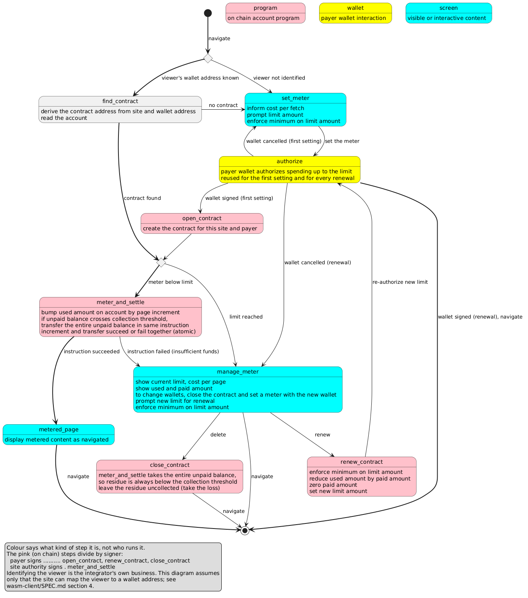

# SolPay

This project offers a pay-as-you-go capability using the Solana
block chain ecosystem.

## What is here

Two Rust crates, and one PHP port:

- `pay-on-chain` — the metering program, built with the
  [Anchor framework][anchor], and its LiteSVM test suite.
- `wasm-client` — the client library a site integrates, published as a crate
  and as a browser bundle. The same bundle runs on a Node server, so the
  server half of an integration does not have to be Rust either. See
  `wasm-client/SPEC.md`.
- `php-client` — a server-side PHP client covering the site-signed half of
  `wasm-client`'s API: PDA derivation, instruction building, account
  decoding, preflight, and error mapping, for a PHP server with no Rust
  toolchain and no WASM runtime. Packaged as a Composer library, not yet
  published. See `php-client/README.md`, and `wasm-client/SPEC.md` §3.1 for
  why a port exists at all.

[anchor]: https://www.anchor-lang.com/docs

## Development

To build the on-chain programs, switch to the `pay-on-chain` directory and
issue the command, `anchor build`. See [getting started with anchor][ags]
for further instructions about working with the anchor programs.

[ags]: https://www.anchor-lang.com/docs/quickstart/local#getting-started

Deploying from a fresh clone needs one extra step, `anchor keys sync`, because
the program keypair is not in the repository. See `pay-on-chain/README.md`.
A local deploy is also the only thing here that wants `solana-test-validator`
running. Building and testing do not: the test suite is in-process.

Four scripts wrap the Rust side:

- `./bin/build-rust` builds the Anchor program and the WASM client. Takes
  `--program` or `--client` to do just one.
- `./bin/test-rust` runs both test suites, and passes any argument through to
  `cargo test` as a filter.
- `./bin/clean` removes what `build-rust` produced — both `target` directories,
  `wasm-client/pkg` and `pay-on-chain/.anchor`. Takes the same two flags. It
  leaves `test-ledger` alone: the local validator's chain state is not build
  output.
- `./bin/update-locks` moves both `Cargo.lock` files to the newest versions
  inside the ranges the manifests already allow, prints what moved, and then
  runs `test-rust` — it does not ask you to. Takes the same two flags. This is
  the deliberate answer to a dependency-drift report; it never crosses a major
  boundary, so adopting a newer major stays a manifest edit and a decision.

The program tests run against [LiteSVM][litesvm], an in-process SVM, so they
need no validator -- but they do load `target/deploy/pay_on_chain.so`, so the
program must be built first.

[litesvm]: https://github.com/LiteSVM/litesvm

The WASM client lives in `wasm-client`. Its core is plain Rust with no browser
dependency, wrapped in a thin `wasm-bindgen` layer; see `wasm-client/README.md`.

`build-rust` and `test-rust` pass `--locked`, so they build the versions in the
committed `Cargo.lock` files or fail rather than re-resolving.
`.github/workflows/rust.yml` runs the same locked build and both suites on
push; `dependency-drift.yml` re-resolves from scratch weekly, so an upstream
release that breaks the version ranges shows up as a red scheduled run instead
of a surprise.

Two more scripts check the other two ways this library gets consumed. They
answer different questions, and the difference is worth keeping straight:

- `./bin/test-node` loads the browser bundle under Node and exercises it.
  A site's server does not have to be Rust: the npm package already runs
  there, with no second build target and no second package, provided `init()`
  is handed the wasm bytes rather than left to fetch them. That last part is a
  property of `wasm-pack`'s generated glue rather than of anything here, which
  is why it is tested instead of asserted. See `wasm-client/SPEC.md` §3.1.
- `./bin/test-php` checks `php-client` against vectors generated from the
  *published* crate. This one is drift control: the PHP package is a second
  implementation of the same encoding, and a port that disagrees does not fail
  cleanly — it builds a plausible transaction that does the wrong thing, and
  then someone signs it. Node runs the same wasm binary the browser runs and
  cannot drift that way; PHP can. See SPEC §8.1.

Each builds or generates whatever it finds missing, so a first run of either
wants `cargo` for the vector generator, `bin/test-node` wants `wasm-pack`, and
`bin/test-php` wants PHP and Composer. `node-conformance.yml` and
`php-conformance.yml` run them on push across more than one runtime — Node 22
and 24, PHP 8.1 and 8.5, where 8.1 is the floor `php-client/composer.json`
declares and so the one worth checking.

## Payment model

The payment model is that someone with a wallet identifies with the wallet and
navigates content. The wallet pays for what they use-- a fee per page view. The
wallet owner sets a limit amount on total charges.  They sign a contract
allowing incremental charges up to the limit.  The site charges the wallet
when enough usage has accumulated to make worthwhile a transfer transaction.
The site asks to refresh the limit when the wallet owner has reached the
spending limit they have set.

See also, the [x402 protocol][x402] from Coinbase.

[x402]: https://docs.cdp.coinbase.com/x402/welcome

## Request flow

This state diagram shows the flow of a page request when navigating
metered content. The bold lines show the happy path.

- The diagram assumes the site can map a viewer to a wallet address, and says
  nothing about how. Accounts, login, SSO -- whatever the site already runs.
  That mapping is the integrator's one obligation; everything else starts from
  the address. See `wasm-client/SPEC.md` §4.
- Every contract is derived from the site and the payer's wallet address, so
  identifying the viewer *is* finding the contract. There is no session token
  in the protocol and nothing to look up but an account.
- Only two authorizations appear in the flow: the site's authority over its
  own contracts, which is what lets it meter, and the payer's authorization of
  the spend, which is the SPL approval the whole design rests on.

In the state diagram, the happy path has bold lines. It goes like this:
- viewer navigates to metered content, and the site knows their wallet address
- server derives the contract address from the site and that wallet address,
  and reads the account
- server increments the usage by the page view amount
- if the viewer has accumulated sufficient unpaid usage, the server
  invokes a transfer from the viewer's wallet
- the server delivers the metered page

Viewers the site cannot place go to the set-meter page. It includes details
about the cost and lets the viewer choose a limit. Setting the meter creates
the contract account and takes the payer's authorization of the spend, both in
one transaction -- the authorization has to come first, and the program checks
that it did.

The dialog and the server must enforce a minimum for
the limit amount that is some multiple of the page view amount.
A multiple of one does not make much sense. Forty or fifty multiple yields a
better minimum. Also, the minimum should be greater than the threshold
amount for making a transfer transaction from the viewer's wallet.

With the account set-up and authorized, the viewer returns to the happy path.

When a viewer reaches their limit, the server shows them a screen that
provides a wrapup of the usage. It offers to renew the limit, or a new limit,
or to delete the contract after a transfer transaction for unpaid usage.

## Licence

Dual licensed under either of

- Apache License, Version 2.0 ([`LICENSE-APACHE`](LICENSE-APACHE))
- MIT license ([`LICENSE-MIT`](LICENSE-MIT))

at your option. See [`LICENSE.md`](LICENSE.md) for why both.
