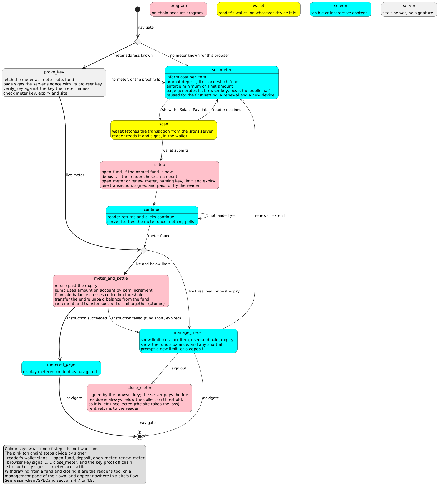

# SolPay

Pay-as-you-go for web content, using the Solana blockchain. A reader's wallet
pays a small fee per use, the money stays in the reader's wallet until
it is spent. Nothing in the protocol records who read what.

This repository delivers `sol-pay`— a metering program on Solana and a client
library.  A site uses the `sol-pay` client libraries to build the metering
program instructions and read its accounts.

The program is deployed on devnet at
`F8UDAGgxVTm8Vmh4RmskpMBCFqhRvuTqbDxDCj8UMedL`.

## What is here

Two Rust crates, and one PHP port:

- `pay-on-chain` — the metering program, built with the
  [Anchor framework][anchor], and its LiteSVM test suite.
- `wasm-client` — the client library a site integrates, published as a crate
  and as a browser bundle. The same bundle runs on a Node server, so the
  server half of an integration does not have to be Rust either. Its API
  specification, `wasm-client/SPEC.md`, is the document to read before the
  code.
- `php-client` — a server-side PHP client covering the site-signed half of
  `wasm-client`'s API: PDA derivation, instruction building, account
  decoding, preflight, and error mapping, for a PHP server with no Rust
  toolchain and no WASM runtime. Published to Packagist from a subtree split;
  see `php-client/README.md`, and `wasm-client/SPEC.md` §3.1 for why a port
  exists at all.

[anchor]: https://www.anchor-lang.com/docs

## Payment model

The payment model is that a caller identifies with a wallet.  The wallet pays
for what they use-- a fee per use. The wallet signs a contract allowing
incremental charges up to a limit.  The site may ask to refresh the limit when
reaching it.

A site running sol-pay executes code in two places, and they sign different
things. The browser holds the reader's wallet and never sees the site
authority; the server holds the site authority and never sees the reader's
key.

| | signs | artifact |
| --- | --- | --- |
| Browser | the reader, through a wallet adapter | the npm package |
| Server | the site authority | the crate, or the PHP port |

### Request flow

This state diagram shows the flow of a page request when navigating
metered content.



The bold lines show the happy path.  It goes like this:

- viewer navigates to metered content, and the site knows their wallet address
- server derives the contract address from the site and wallet addresses,
  and reads the account
- server makes one metering call, which raises the usage by the page view
  amount
- that same call moves money only when the unpaid total has reached the
  collection threshold. The transfer is a cross-program invocation inside the
  metering instruction rather than a transaction of its own
- the server delivers the metered content

The diagram assumes the site can map a viewer to a wallet address, and says
nothing about how. Accounts, login, SSO — whatever the site already runs.
That mapping is the integrator's one obligation; everything else starts from
the address. See `wasm-client/SPEC.md` §4.

Every contract is derived from the site and the payer's wallet address, so
identifying the viewer *is* finding the contract. There is no session token
in the protocol and nothing to look up but an account.

Only two authorizations appear in the flow: the site's authority over its
own contracts, which is what lets it meter, and the payer's authorization of
the spend, which is the SPL approval the whole design rests on.

Viewers without a contract go to the set-meter page. It includes details
about the cost and lets the viewer choose a limit. Setting the meter creates
the contract account and takes the payer's authorization of the spend, both in
one transaction. The authorization has to come first. The program checks
that it did.

The dialog and the server must enforce a minimum for
the limit amount that is some multiple of the page view amount.
A multiple of one does not make much sense. Forty or fifty multiple yields a
better minimum. The program itself requires the minimum to exceed the
collection threshold and refuses `initialize_site` otherwise
(`MinimumBelowThreshold`): a minimum at or below the threshold would let a
payer sign up for less than a single collection, so the first settle could
never fire within their limit.

With the account set-up and authorized, the viewer returns to the happy path.

When a viewer reaches their limit, the server shows them a screen that
provides a wrapup of the usage. It offers to renew the limit, at the same
amount or a new one, or to close the contract.

Closing forgives whatever is unpaid. That is a decision rather than an
omission. A transfer can always be refused -- a short balance, an approval
revoked or replaced, a frozen account -- and a close is where those are most
likely. A close carrying a transfer could fail and leave the payer unable
to leave. `close_contract` therefore emits `Closed { forgiven }` and moves no
money.

## What the integrator owns

Thisis a library, not an application. The cyan nodes in the state diagram --
`set_meter`, `manage_meter`, `metered_page` -- are screens the *integrator*
builds. They appear in the design only to establish what the library owes
them: the data needed to render each screen, and the operations its controls
invoke. Nothing else. The library does not route, render, format, or decide.

The obligation that comes with that is a single sentence: **keep a mapping
from your viewer to a wallet address, and hand us the address.** The payment
core needs exactly one input. `meter_and_settle` derives the contract from
`[b"contract", site, payer]`. Its accounts carry no session token of
any kind. Who the visitor is stays the site's own affair -- accounts, login,
SSO, whatever it already runs.

This library is authoritative about instruction encoding, PDA derivation,
account layout, the rule that `approve` must precede `open_contract` in the
same transaction, and the arithmetic that decides whether a meter call will
succeed. It has no view on what limit to suggest, how to format an amount, when
to show the meter, or what to do when a payment fails.

Metering may be an additional way to pay. A publisher with subscriptions may
opt to keep them; metering is what it offers the reader who will
not subscribe. SPEC §4.4 has integration consequences for that scenario.

## The demonstrator

[`wbreeze/sol-pay-demonstrator`][demo] is a working site that meters a set of
articles on devnet, built on the PHP port. It is a reference integration:
everything this repository declines to supply — RPC, the wallet adapter, the
session, the viewer-to-wallet map, the decision to meter a request, error
attribution, log hygiene — is there, in one place, in the smallest honest
form. Its three screens are the three this library names.

[demo]: https://github.com/wbreeze/sol-pay-demonstrator

## Installing

The client library is published as `sol-pay-client`, once per language. The
three are one library: the same instructions, the same encoding, for the same
program.

```
cargo add sol-pay-client                 # a Rust server, or a Rust front end
npm install sol-pay-client               # the browser, and Node servers
composer require wbreeze/sol-pay-client  # a PHP server
```

[crates.io][crates] · [npm][npm] · [Packagist][packagist]

[crates]: https://crates.io/crates/sol-pay-client
[npm]: https://www.npmjs.com/package/sol-pay-client
[packagist]: https://packagist.org/packages/wbreeze/sol-pay-client

## Development
Four scripts wrap the Rust side:

- `./bin/build-rust` builds the Anchor program and the WASM client. Takes
  `--program` or `--client` to do just one.
- `./bin/test-rust` runs both test suites, and passes any argument through to
  `cargo test` as a filter.
- `./bin/clean` removes what `build-rust` produced — both `target` directories,
  `wasm-client/pkg` and `pay-on-chain/.anchor`. Takes the same two flags. It
  leaves `test-ledger` alone: the local validator's chain state is not build
  output.
- `./bin/update-locks` moves all three `Cargo.lock` files to the newest versions
  inside the ranges the manifests already allow, prints what moved, and then
  runs whichever suite builds from them — it does not ask you to. Takes
  `--program`, `--client` or `--vectors`; the third is `php-client/vectors-gen`,
  which is proved by `test-php` rather than `test-rust` because nothing in the
  Rust suites builds it. This is the deliberate answer to a dependency-drift
  report; it never crosses a major boundary, so adopting a newer major stays a
  manifest edit and a decision.

The program tests run against [LiteSVM][litesvm], an in-process SVM, so they
need no validator -- but they do load `target/deploy/pay_on_chain.so`, so the
program must be built first.

[litesvm]: https://github.com/LiteSVM/litesvm

The WASM client lives in `wasm-client`. Its core is plain Rust with no browser
dependency, wrapped in a thin `wasm-bindgen` layer; see `wasm-client/README.md`.

`build-rust` and `test-rust` pass `--locked`, so they build the versions in the
committed `Cargo.lock` files or fail rather than re-resolving.
`.github/workflows/program-tests.yml` runs the same locked build and both
suites on push; `dependency-drift.yml` re-resolves from scratch weekly, so an
upstream release that breaks the version ranges shows up as a red scheduled run
instead of a surprise.

Deploying from a fresh clone needs one extra step, `anchor keys sync`, because
the program keypair is not in the repository. See `pay-on-chain/README.md`.
A local deploy is also the only thing here that wants `solana-test-validator`
running. Building and testing do not: the test suite is in-process.

### The three consumption checks

Three more scripts check the other ways this library gets consumed. They
answer different questions, and the difference is worth keeping straight:

- `./bin/test-node` is the *loading contract*. It loads the browser bundle
  under Node and exercises it. A site's server does not have to be Rust: the
  npm package already runs there, with no second build target and no second
  package, provided `init()` is handed the wasm bytes rather than left to
  fetch them. That last is a property of `wasm-pack`'s generated glue
  rather than of anything here, which is why it is tested instead of asserted.
  Node runs the same wasm binary the browser runs and so cannot disagree with
  the crate. See `wasm-client/SPEC.md` §3.1.
- `./bin/test-php` is a *second implementation* against the crate. It checks
  `php-client` against vectors generated from the *published* crate.
- `./bin/test-kit` is this library against an *outside package neither side
  pins*. `wasm-client/src/lib.rs` serialises instructions as `@solana/kit`'s
  `IInstruction`, `role` and all. Nothing declares that agreement anywhere
  a package manager can see. `Cargo.toml` names no JavaScript dependency and
  the bundle has no `import` in it.

Each builds or generates whatever it finds missing, so a first run wants
`cargo` for the vector generator; `test-node` and `test-kit` want `wasm-pack`,
`test-kit` additionally wants `npm`, and `test-php` wants PHP and Composer.

### CI

*`node-conformance.yml` and `php-conformance.yml`* run the first two checks on
push to Github.  They execute across more than one runtime: Node 22 and 24, PHP
8.1 and 8.5.  PHP 8.1 is the floor `php-client/composer.json` declares.

*`kit-agreement.yml`* runs the third check on Node 22, and again on a weekly
schedule, because the news it carries can arrive without a commit.

### Publishing

Publishing is deliberately not scripted for any of the three. It is rare,
irreversible, and needs credentials that belong to a person rather than to a
repository. `wasm-client/README.md` covers `cargo publish` and `wasm-pack
publish`, which share one version number out of `Cargo.toml`.

PHP needs one more step, because Packagist derives a version from a git tag
and a tag here would claim to version the other two artifacts as well.
`./bin/split-php-client` produces the read-only repository Packagist publishes
`php-client` from, and proves it is publishable — Composer needs
`composer.json` at a repository root and a tag that *is* the version. It
verifies and stops: pushing, tagging and publishing leave the machine and stay
manual, the same as `cargo publish`. See `php-client/README.md`,
"Publishing".

## Licence

Dual licensed under either of

- Apache License, Version 2.0 ([`LICENSE-APACHE`](LICENSE-APACHE))
- MIT license ([`LICENSE-MIT`](LICENSE-MIT))

at your option. See [`LICENSE.md`](LICENSE.md) for why both.
