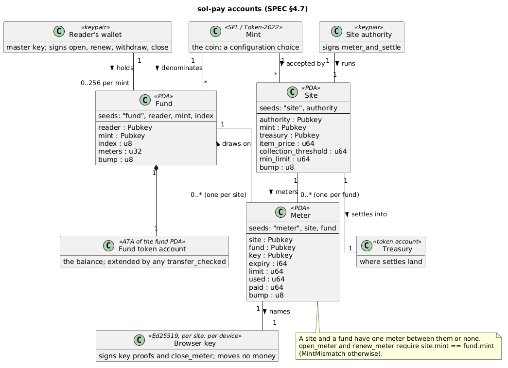

# sol-pay-client — API specification

This specifies the client library that a site integrates. It is the companion
to `state-machine.plantuml` at the repository root, which remains the
authoritative description of the flow. Where this document and the diagram
disagree, the diagram is right and this document is a bug.

**The sections marked *redesign* specify the fund design (§4.7) that
replaces the delegate design, decided 2026-09-28 and implemented
2026-09-29.** The diagram and the README were redrawn for it on 2026-09-29,
once the implementation existed to check them against, and the sentence
above holds again for every section. The devnet deployment and the published
`0.1.x` artifacts remain the delegate design until the next publish.

**Why the redesign, in one paragraph.** The delegate design borrowed its
authority model from two things this project does not control: SPL Token's
single `delegate` field, which admits one site per token account and
collides with any other program that wants the field, and the browser
wallet's feature surface, which decided who could sign in and on which
device. Every limit on who could read a metered page traced back to one of
those two. The fund design keeps the authority inside the program, where
the chain is rigid and the library can be too, and moves the one signature
that spends money to the reader's wallet on whatever device the wallet is,
by a Solana Pay scan rather than a browser adapter. Nothing else about the
metering changes: the site's server still signs `meter_and_settle` with the
reader absent, the collection threshold still does what §4.6 says, and
closing still forgives the residue.

**Names changed 2026-09-29, §4.11.** The vault is a *fund*, the contract a
*meter*, its owner the *reader*, and what a meter counts an *item* rather than
a page view. The rename is applied across the repository -- program, both
ports, scripts, README and diagram -- as a change of its own, ahead of the
redesign and separate from it, so that neither diff hides the other.

## 1. What this is

A library, not an application. sol-pay ships no user interface. The cyan nodes
in the state diagram -- `set_meter`, `manage_meter`, `metered_page` -- are
screens the *integrator* builds. They appear in the design only to establish
what the library owes them:

1. the data needed to render each screen, and
2. the operations its controls invoke.

Nothing else. The library does not route, render, format, or decide.

**Out of scope, decided 2026-08-31, narrowed 2026-09-28: identifying the
viewer.** The library takes a meter address and says nothing about how
the integrator obtained it. §6.6 ships the one primitive a site with no
account system needs in order to obtain it, and stops there. The rationale
is in §4.

**Metering is an additional way to pay, not a replacement for the ones a site
already has.** A publisher with subscriptions keeps them. Metering is what it
offers the reader who will not subscribe -- the one who arrived from a link,
wants one article, and would otherwise bounce off the paywall. Nothing in this
library assumes it is the only way a viewer can reach the content, and the
integration consequences of that are in §4.4.

## 2. The design rule

**Be rigid where the chain is rigid. Be silent where the site has a
legitimate choice.**

An integrator rejects a library that dictates their product. They keep one
that stops them shipping bugs. Everything below is sorted by that rule.

### Chain facts — the library is authoritative

Wrong here costs a failed transaction and a real fee, so the library owns
these completely and no integrator should reimplement them:

- instruction encoding, account order, and Anchor discriminators
- PDA derivation for site, fund, the fund's token account, and meter
- account layout and decoding
- the rule that a fund must exist before anything is deposited to it, and
  that a meter's mint is its site's mint
- the arithmetic that decides whether a meter call will succeed, including
  that a meter past its expiry cannot be metered
- that the fund's seeds, not the reader's signature, authorize the transfer
  a settle makes -- so the only thing that can refuse a settle for lack of
  money is the fund's balance
- the mapping from an on-chain error code to a cause the UI can branch on
- verifying that a key proof (§6.6) was signed by the key a meter names

*(redesign: the two `approve` rules that stood here -- ordering before
`open_meter`, and replacement rather than addition -- are gone with the
delegate. §4.7.)*

### Site policy — the library has no view

- what limit to suggest or offer
- how to format an amount, or in what currency to display it
- when to show the meter, redirect, or block
- whether metering is per view, per article, or batched
- **how the server identifies the visitor** (§4)
- what to do when a payment fails

If a future API would decide any of the above, it does not belong here.

**The line, stated once: describe the chain's state, do not prescribe the
site's response.**

## 3. Two consumers

*(redesign, 2026-09-28: three signers and a fourth party, below. The section
keeps its title because §3.1 and everything that cites it are about the
server row, which is unchanged.)*

A site running sol-pay executes code in two places, with different needs,
and one more party signs without running any of the site's code at all.

| | signs | needs | artifact |
| --- | --- | --- | --- |
| Reader's wallet | the reader, via a Solana Pay transaction request the site's server composes | nothing of ours: it scans, signs and submits | none -- any wallet that scans Solana Pay |
| Browser | the site's key for this reader (§4.8) | a key proof (§6.6); `close_meter` for sign-out | npm package |
| Server | site authority; composes the wallet's transaction | `meter_and_settle`, `initialize_site`, `open_fund`, `deposit`, `open_meter`, `renew_meter`, `close_meter`, decoders, preflight, `verify_key` | crates.io crate, or a port -- §3.1 |

The server never holds the reader's wallet key and never holds the browser's
key; the browser never holds the site authority. `meter_and_settle` is the
only instruction the site signs *as authority*, and the program enforces it
(`has_one = authority`). The server also builds, but does not sign, every
reader-signed instruction: it composes them into the one transaction the
wallet fetches through the transaction-request endpoint (§4.9) and the
wallet signs it. That is why the reader-signed half now sits in the server
row. Under the delegate design it sat in the browser row, signed by a wallet
adapter, and a port for a server language could omit it; a PHP server now
composes it, so `php-client` grows to cover it (§8.1).

The browser row shrinks to almost nothing, and that is the point of the
redesign. The site's page holds one key, generated in the browser and never
leaving it, and uses it for exactly two things: proving to the site's server
that this browser is the one a meter names, and signing a close when the
reader leaves a machine. Neither moves money. Everything that moves money is
signed by the wallet.

### 3.1 The server row does not say Rust

The browser row was settled by something outside anyone's choice -- Wallet
Standard is browser JavaScript, so under the delegate design the reader signed
in a browser whatever else was true -- and the redesign settled it further
still, by taking the wallet out of the browser and leaving the page one key
and a proof (§3, §4.8). The server row is not settled. It says what the server *needs*, not
what it is written in, and an early draft of this table said "crates.io crate"
as though those were the same thing.

A survey of the sites that would plausibly adopt this, 2026-09-02, found the
assumption expensive. PHP is the server-side language of about 70% of the sites
W3Techs can identify, and of essentially the entire CMS market; Node serves
most of the large publishers that already run paywalls; Rust is not tracked at
all, and appears nowhere in the sub-0.1% tail. No news publisher of any size
was found running a Rust web application server. **A crates.io crate on its own
therefore reaches on the order of 1% of candidate integrations, and
approximately none of the ones that already have a paywall to replace.**

That is not an argument against the crate. It is the right core and the right
place for the encoding, and everything else here is built from it. It is an
argument that the crate is not by itself a distribution strategy.

What exists so far is `php-client`: a port of this row -- the site-signed
instructions, the decoders, preflight, units and errors -- for a server with
no Rust toolchain and no WASM runtime. Under the delegate design the
reader-signed half was absent from it deliberately, since a wallet adapter in
the browser signed those whatever the server ran. **That reason is gone with
the redesign** (2026-09-28): the reader-signed instructions are now composed
by the server into the transaction the wallet fetches (§4.9), so a PHP server
needs their builders, and `php-client` takes them on. A port is the most
expensive of the available answers, and §8.1 says what it costs to keep one
honest; the redesign makes it cost more, not less.

**The Node tier is already served, by the artifact that exists.** Measured
2026-09-04; it needed no build target and no second package. Nothing in the
wasm layer is browser-specific -- it pulls in `wasm-bindgen` and
`serde-wasm-bindgen` and converts values, with no `web-sys`, no `js-sys` and
no fetch -- so the `--target web` bundle runs unchanged under Node. There is
exactly one difference: the zero-argument `init()` resolves the `.wasm`
against `import.meta.url` and fetches it, and Node's fetch does not do `file:`
URLs, so a Node caller passes the bytes instead. Against the same vectors
`php-client` is checked with, the bundle under Node matched the published
crate on 400 `site` PDAs, 400 `meter` PDAs, the `meter_and_settle` data and
account order, and `decodeSite`. `README.md` carries the recipe.

That is a claim about `wasm-pack`'s generated glue and not about anything in
this repository, which is why it is tested rather than asserted: `bin/test-node`
and the `node conformance` workflow. It is not §8.1's kind of exposure. Node
runs the same wasm binary the browser runs and cannot diverge from it; what
could break is the loading contract, silently, in a release of a tool.

The remedy is a **sidecar** with a documented HTTP interface: one deployable
that reaches any language at all, for the people who would rather have
that than a package. This section carried it as explicitly undecided from the
day it was written; it is **decided 2026-09-04**, and what decided it was not
the unserved-language list below, which has not moved. It was that a PHP site
authority needs transaction assembly it cannot get honestly from any existing
package, and that the demonstrator needs somewhere for a site authority key
to live. Those are one object: a sidecar is a signing oracle, so it is
simultaneously the reach answer and the custody answer, and deciding either
of them alone would have answered the same question twice, differently.

What is decided is that it gets built, not what it is. Its trust boundary --
a Unix socket and file permissions, or mTLS -- belongs to this library rather
than to each integrator's invention, and is not designed yet; neither is
whether it lives in this repository -- and if it ever drags too many releases
along behind it, splitting it into its own code base stays available, which
is the same remedy `php-client/README.md` already records for Packagist's
repo-wide tags.

What the sidecar does not reach is PHP. A sidecar is the answer for a
language with no package; PHP has one, and one whose zero runtime
dependencies and 8.1 floor are the reason it installs where it has to, so
**PHP reaches transaction assembly through `SolPay\Tx` instead** -- decided
2026-09-04, `php-client/README.md`, "Transaction assembly". The
consequence is deliberate and is not softened here: this library keeps a
second implementation of the encoding, §8.1's objection included, and §8.1
names the machinery that has to carry it.

What is left unserved by a Rust crate, a Node-loadable bundle and a PHP port
is Ruby, Java, Scala, ASP.NET and Python: together roughly a fifth of the
sites W3Techs can identify, and, unlike PHP, fragmented -- no single CMS mass
the size of WordPress to aim a port at. That shape is the argument for one
sidecar over four more ports, and it is the whole of the case either way.

## 4. What the integrator owns

Two things sit outside this library that an integrator has to get right
anyway: knowing who the viewer is, and deciding whether this request should be
metered at all. Neither is ours. This section says so explicitly, because an
earlier draft of the design tried to solve the first on the site's behalf.

### 4.1 The payment core needs one input

*(redesign, 2026-09-28. The previous text of this section, which said "the
reader's wallet address" and then spent four paragraphs on the token-account
precondition that undid it, is replaced whole.)*

`meter_and_settle` derives the meter from `[b"meter", site, fund]`.
Its accounts carry no session token of any kind. `open_meter`,
`renew_meter` and `close_meter` are the same: the fund is the seed,
and the account that signs is either the fund's reader or the key the
meter names.

So the payment core needs exactly one thing from the integrator: **the
reader's fund address**, or equivalently the meter address derived from
it. Two questions are cleanly separable, and only the second is ours:

- **Who is this visitor?** -- the site's own affair. Accounts, login, SSO,
  whatever they already run; or nothing but the key proof in §6.6, which is
  enough on its own.
- **What do they owe?** -- the payment core.

The integrator's obligation is therefore a single sentence: *keep a mapping
from your viewer to a meter, and hand us the meter.* Everything the
library does starts from there.

There is no precondition this time. The meter names the fund it draws
from; the fund names its token account by derivation; and nothing about
which token account a reader's wallet happens to surface enters into it. A
reader holds as many meters as they have sites, on one fund or several
(§4.7), and a site stores one address per viewer.

What the site stores is the meter address rather than the fund address
for a reason worth stating: the meter carries the key (§4.8), so a site
holding the meter can verify a key proof with one fetch and no further
lookup, and two devices at one site are one meter renewed with a new key
rather than two records.

### 4.2 What this replaces

Earlier revisions specified a "bump slug": a random token in the URL path,
indexed on chain by a `SlugIndex` PDA, that resolved a request to a meter
without the site holding any session state. It carried two justifications and
neither survived.

**Avoiding a cookie-consent banner.** Authentication session cookies are the
textbook "strictly necessary" case under the ePrivacy Directive and need no
banner, provided they are used only for authentication and are session rather
than persistent "remember me" cookies. A site that logs people in was already
clear on that count. (Not legal advice; the integrator's counsel decides.)

**Gifting a page view by sharing a link.** A slug in a URL is a bearer token
for the reader's *entire remaining balance*, so sharing one gifts the balance
rather than an article. The familiar publisher feature -- a one-time, expiring,
single-article gift link -- is a different mechanism, and if it is ever wanted
it should be built in that shape.

Removing the slug also removes a defect. Because `Contract.slug` was a plain
field in a public account and the meter PDA derives from public seeds, every
meter was enumerable -- one `getProgramAccounts` on the discriminator, or
the program's own transaction history -- and each hit yielded a working bearer
token. A third party could consume any reader's balance to the limit. That is
theft of service rather than of money, since the money reaches the site
treasury, which makes a content scraper the likelier actor than a vandal. No
slug, nothing to steal.

What is genuinely given up: a site can no longer run sol-pay with **no**
server-side session state. Every integrator now keeps a viewer-to-meter
mapping. That was a real property and it is being traded deliberately.

### 4.3 Transparency

*(redesign, 2026-09-28. This section was titled "What remains public" and
was one paragraph. It is now the place this document says what a public
ledger does to a reader, and why the design does not apologize for it.)*

Everything the program holds is visible to anyone: given a fund, its
balance and every meter it holds; given a meter, its site, its limit,
used and paid figures, its expiry and the key it names; given a site, its
treasury and every settle that ever landed there. That is a property of
putting a spend meter on a public ledger, not a defect, and no client
library can change it. Integrators whose readers would care should be told
plainly rather than reassured.

**The frame this document takes is transparency rather than privacy**, and
the distinction is the one Brin drew in *The Transparent Society*: the harm
in surveillance is not that someone can see, it is that the seeing runs one
way. Metering behind a password is maximally one-way. The site knows what a
reader read and when, keeps or sells that on terms nobody reads, and the
reader can see none of it. This ledger is two-way. The reader can see, to
the base unit, what each site drew and when it settled; the site's treasury
is exactly as visible as the reader's fund; and there is no contract of
adhesion because there is nowhere to put one.

What the ledger shows is also modest, and the specification should say how
modest rather than let a reader imagine worse. A meter records aggregate
usage against one site, moved at threshold granularity: *this fund has
read about this much at this site*. It does not record which pages, nor
when any one of them was read; `Metered` events carry a count and a running
total, and a site that batches items (§2, site policy) coarsens even that.
The pseudonym is the wallet, not a name. A reader who holds several funds
in one mint uses the index in a fund's seeds (§4.7) to keep *budgets*
apart -- everyday reading in one, a small float for public machines in
another. It does not keep *identities* apart: a fund records its reader, and
the reader signs every transaction that opens, extends or closes it, so every
fund a wallet holds is linked to that wallet, and to the others, in plain
view. A reader who wants two contexts kept apart holds two wallets and
extends their funds from sources that are not themselves linked. That is a
real tool, in the reader's hands, and it is more than the password era ever
gave them.

Two limits, each in one sentence, so that nothing here is read as a promise
the design cannot keep. **Privacy is not promised**: the ledger is public,
every fund one wallet holds is linked to it, and two wallets extended from
one source are linked to each other. **Reciprocity is not complete**:
fetching from the chain is itself unmetered and unobserved, so a party that
correlates deposit sources at scale sees the reader without being seen, and
curing that would mean RPC endpoints metering transparently in their turn,
which is out of scope here and probably out of scope anywhere.

### 4.4 Coexisting with a subscription

The state diagram draws the metered path. It does not draw the decision that
precedes it -- whether this request should be metered at all -- because that
decision belongs to the site and will usually be made against a subscription
or entitlement the library knows nothing about.

Three consequences for an integrator running both:

**A meter is not a viewer type.** Someone may hold a subscription and a
meter at once: a subscriber reading outside their tier, or a metered reader
who subscribes later and whose meter is still open. Keying access control
off "has a meter" will eventually charge a subscriber. The meter answers
what a viewer has authorized, never whether they are entitled to the page.

**Metering the same item twice is the site's problem to avoid.** The program
meters whatever `items` the authority passes and has no idea the viewer
also has a subscription. The library's `can_meter` reports whether a charge
would succeed, not whether it should happen. Only the site knows that.

**Ending a meter takes one instruction.** When a metered reader subscribes,
the site will want the meter to stop. Simply not calling `meter_and_settle`
is nearly enough -- with no delegate there is nothing dormant left on the
reader's account, and an idle meter blocks nothing -- but it leaves an
account open that the reader is paying rent on, with an expiry that will
eventually refuse a settle the site never meant to send. Close it.
`close_meter` is signed by the reader or by the meter's key, and
returns the rent to the reader.

*(redesign, 2026-09-28: this paragraph said "two instructions, not one" and
described the dormant delegate approval that used to block a reader from
every other site. §4.7.)*

Closing forgives the residue, so the site absorbs whatever was unpaid. That is
bounded below the collection threshold by construction, so it is small, but it
is not nothing, and it is a real cost of converting a metered reader into a
subscriber.

### 4.5 Which deployment, and which token program

Decided 2026-09-01. Neither is a constraint; both are defaults, and both are
stated once rather than at every call site.

**The program id.** The `Site` PDA is seeded by authority, so one deployment
already serves many sites with independent pricing, and a single canonical
deployment remains the intended model. But compiling the id in as the *only*
id means an integrator who wants their own deployment cannot use the published
package at all. That is a reason to reject the library, and it costs almost
nothing to remove.

**The token program.** A mint belongs to SPL Token or to Token-2022, and every
instruction that touches the fund's token account has to name the right one.
Strictly this is a property of the *mint*, not of the deployment -- one
deployment serves many sites, each site names its own mint, so two sites on one
deployment could differ. It sits on the handle anyway, because a client
instance serves one site, and repeating the same word at nine call sites to say
so is worse. A caller that really does span both holds two handles.

`core::Program` carries the pair. `Program::default()` is the canonical
deployment on SPL Token; `Program::new(id)` changes the first,
`.with_token_program(id)` the second, and they vary independently. Every
derivation, instruction and error name hangs off the handle as a method, and
the free functions in `core::pda`, `core::ix`, `core::tx` and `core::error` are
those same methods with the default filled in -- so the common case costs
nothing and each override costs one call. Across the WASM boundary the same
thing is the `PayOnChain` class (§6.7).

Consequences worth stating outright:

- **`error::cause` follows the deployment.** It decides "is this one of ours"
  by comparing the raising program against the handle's address. Had the
  override reached the instruction builders but not this comparison, a site on
  its own deployment would have seen every named failure in §6.4 quietly
  degrade to `Unknown` -- the library's error vocabulary lost to exactly the
  integrator the override was built for.
- **`deposit` and `withdraw` depend on both.** They go to the handle's token
  program, and the fund token account they land in or draw from is derived
  from the handle deployment's fund PDA.

- **On `meter_and_settle` the token program is an account, not the callee.**
  The instruction still goes to the metering program, which CPIs into the token
  program to move the money.

Nothing is verified about the program id: an address with no program behind it
builds perfectly good instructions that fail at the runtime, and confirming a
deployment exists needs a network this library does not have and does not want.
The token program has a cheap check, because the answer is already in hand --
`Program::owns_mint` takes the `owner` that came back beside the mint's data
from `getAccountInfo` and says whether it matches. Moving a required argument
into state removes nine chances to get it wrong and adds one; that method is
the one.

**Which mints, decided 2026-09-28.** Plain SPL Token, and Token-2022 mints
that carry no extensions. Nothing in the program depends on the asset -- a
fund is seeded by mint, a site names its mint, and a second currency is a
configuration choice for whoever deploys a site -- but Token-2022's
extensions each change what a settle delivers or who else can move the
money, and the library will not carry a view on each one. A mint with a
transfer fee or a transfer hook settles for something other than `unpaid`,
which breaks the invariant `paid == used` after a settle; a mint with a
permanent delegate can be drained by its issuer whatever the fund says, and
must be refused outright. `Program::owns_mint` already says which token
program a mint belongs to; whether a Token-2022 mint carries extensions is
visible in the same account data, and a site should check it once at
`initialize_site` rather than discover it at the first settle.

### 4.6 Why there is a collection threshold

Written 2026-09-22, because the reasoning had never been recorded and the
README's summary of it was wrong.

`meter_and_settle` carries the transfer as a cross-program invocation inside
the same instruction that raises `used`. So the threshold does **not** save
transactions or fees: a site settling on every view sends the same number of
transactions, and pays the same fees, as a site settling on every tenth. The
README said the site charges "when enough usage has accumulated to make
worthwhile a transfer transaction", which invites exactly that mistake.
There is no transfer transaction.

What the threshold does buy, in the order the argument is worth making:

- **It keeps writes off the treasury.** A settling call writes the site's one
  treasury token account. The runtime serializes transactions that write the
  same account, so every settle queues behind every other settle for that
  site. A call that only counts writes that reader's own meter account,
  and no two readers share one. At a threshold of ten items, nine calls
  in ten stay out of that queue. Seen from outside, it is also a tenth of the
  scheduling capacity spoken for.
- **It keeps most calls unable to fail.** A transfer can be refused: a short
  balance, an approval that no longer covers the amount, a frozen account. A
  counting call has nothing to refuse. Settling on every item puts every item
  behind a refusal that a site then has to explain to a reader mid-read.
- **It would pay per-transfer costs less often**, were §4.5 ever to admit a
  Token-2022 mint with a transfer fee or a transfer hook. Since 2026-09-28 it
  does not, so this argument is recorded rather than relied on.

**What it costs the site.** The unpaid residue is earned and uncollected. It
is bounded below the threshold by construction (§4.4), closing forgives it,
and it is the amount at risk if the fund is drawn down, the meter
expires, or the reader signs out before the next settle. The threshold is therefore a trade the site makes
against its own float, and where to set it is site policy under §2: the
library takes the number and has no view on it.

**What it offers the reader.** Closing forgives the residue (§4.4, §4.8), so
the threshold is also the size of a free sample. A site offers a limited
reading experience, uncharged, in return for a limited commitment from the
reader: a scan, a deposit, and a meter opened with a limit and an expiry. A
reader who reads less than a threshold's worth of items and then signs out
has paid nothing, and the site has met a reader who had already committed to
paying. Added 2026-09-29; it is the same fact as the cost above, seen from
the reader's side.

**The dodge, stated because someone will think of it.** Read to just below
the threshold, sign out, open again, repeat: nothing is ever charged. The
site is not helpless. Its server composes every `open_meter` (§4.9), and a
second opening from the same fund lands on the same address,
`[b"meter", site, fund]`, so the site sees the repeat and may decline to
compose it. A fund at a new index (§4.7) has a new address but names the same
reader, so a site that remembers readers rather than funds sees through that
too. Escaping it takes a new wallet, with SOL for rent and fees and a deposit
moved into it, for less than a threshold's worth of items each round. The
dodge is bounded by what it costs the dodger, and where to set the threshold
is also where a site prices its free sample and the payoff for dodging it --
one more reason §2 leaves the number to the site.

**The contention claim is reasoning, not a measurement**, and it should stay
labelled that way. Making the queue visible would mean pushing enough
concurrent settles through one treasury to look like an attack on a public
endpoint, and a local validator does not reproduce the scheduler this claim
is about.

### 4.7 The fund *(redesign)*

Decided 2026-09-28; renamed, and the relations and index written out,
2026-09-29. The reader's money moves once, from wherever it was, into a token
account the program controls; every site the reader meters draws from that
account within a limit the reader set for that site; and the reader takes
back whatever is left whenever they like.

**The account.** A `Fund` PDA, seeded `[b"fund", reader, mint, index]`,
holding `reader`, `mint`, `index`, a count of open meters, and its bump. Its
token account is the associated token account of the fund PDA for the mint
-- derivable from the fund address, so the fund records nothing about it,
and `open_fund` creates it. Money reaches a fund by an ordinary
`transfer_checked` to that account from anywhere: the reader's own wallet in
the setup transaction, a second wallet later, an exchange withdrawal straight
to the address. No instruction of this program is involved in extending a
fund and none is needed; the fund's balance is the token account's balance,
and the library's `deposit` builder is that transfer, addressed.

**How funds, meters and sites relate.** A fund serves any number of sites,
with at most one meter at each: a meter's address is `[b"meter", site, fund]`,
so a site and a fund have one meter between them or none. A reader therefore
needs one fund per mint, not one per site. A second fund in the same mint is
for a second budget, or for a second device at one site at the same time
(§4.8).



*`accounts.plantuml`, beside this document, is the source.*

A fund can meet only sites whose mint is its own. The mint sits on both
accounts because each is fixed when its account is created -- a reader picks
a coin when they open a fund, a site when it is initialized -- and the meter
is where the two choices have to agree. `open_meter` and `renew_meter`
compare the site's `mint` with the fund's and fail with `MintMismatch` when
they differ, so the disagreement surfaces while the reader is setting up
rather than at the first settle, mid-read.

**The index.** It lets one reader hold several funds in one mint, and it is
for keeping budgets apart: a fund for everyday reading and a small one for
public machines, say, each with its own balance and its own meters. It is
not for keeping identities apart, which takes separate wallets (§4.3).

The index is one byte, so a reader holds at most 256 funds in one mint *at
once* -- closing a fund frees its index for reuse. One byte is chosen for
enumeration. A management page (§4.10) finds a reader's funds by deriving
all 256 addresses and fetching them in three `getMultipleAccounts` calls of
up to a hundred each, with no `getProgramAccounts` -- the scan that managed
RPC providers throttle, price or disable, and that the slug index was built
to avoid (§4.2). Two bytes would make that about 650 calls. Nothing in the
program treats index zero specially.

**The instructions.** `open_fund(index)`, `withdraw(amount)` to any token
account of the mint, and `close_fund`, all signed by the reader, the last
refusing while the balance is non-zero (`FundNotEmpty`) or a meter is open
(`FundHasMeters`). `open_fund` creates the fund; it does not find or reopen
an existing one, and there is no separate create. The caller chooses the
index, and choosing one already in use fails at account creation, so
uniqueness is the runtime's guarantee and the program keeps no counter.
Which index a site's transaction names is the reader's choice, made
explicitly (§4.9). Rent for the fund and its token account is the reader's
and comes back on close.

**What replaces the delegate.** `meter_and_settle` still transfers by CPI
when the unpaid balance reaches the threshold; it now signs as the fund
PDA rather than the contract PDA that the delegate design approved,
moving from the fund's token account to
the site's treasury. `require_delegate` is gone, and with it
`DelegateNotSet`, `DelegateMismatch` and `DelegateAllowanceTooLow`: there
is no second copy of the limit to check against the first. The meter's
`limit` is the whole of the per-site allowance, enforced by the program on
`used`, and the fund's balance is the whole of what any site can reach.

**Who is bounded by what.** This is the sentence the design has to keep
true, so it is stated once:

> A site can take at most its meter's limit before its expiry. A browser
> can take nothing. The program can take at most the fund's balance. The
> reader sets all three.

The first two follow from the instructions above and §4.8. The third is a
statement about trust rather than about code: under the delegate design a
reader trusted the program with an allowance, and under this one they trust
it, and whoever holds its upgrade authority, with a balance. Meter and
expiry bound what sites and browsers can do; nothing but the reader's habit
of keeping the balance small bounds what a malicious upgrade could do. That
is the argument for making the program immutable sooner than a project
would otherwise choose to, and for a site saying so on the page where the
reader decides how much to deposit.

**What custody gives up, and why the earlier objection does not hold.** The
delegate design was chosen over an escrow on 2026-08-30 for two reasons:
money left the wallet early, and "insufficient funds" became an edge the
diagram draws that nothing could reach. The first is real and is the price
of everything §4.7 through §4.9 buy. The second was wrong. A reader can
withdraw at any time, and several sites draw one fund down concurrently,
so a settle can still find less than it needs; the edge moves from "wallet
balance" to "fund balance" and the state machine draws it identically.
What actually changes is that the ambiguity in §6.4 -- SPL returning
`InsufficientFunds` for a short balance and a short allowance alike --
disappears, because there is no allowance for it to be short of.

**Losing a key.** Under the password model, forgetting a password costs an
identity-recovery ordeal and losing one to theft costs whatever the account
could do. Here the two keys cost different things and both are small. The
browser key (§4.8) can move no money, so losing it or having it stolen
costs nothing but a new scan. The wallet is the master key, and losing it
loses the fund balance -- which the reader chose, with that risk in view,
the way people decide how much cash to carry. There is no recovery ordeal
because there is nothing to recover: the exposure of a lost key and a
stolen key are the same bounded number. That is a new hygiene, and the
page should teach it in one sentence -- *keep in the fund what you would
keep in a pocket* -- rather than promise a safety net the design does not
have.

### 4.8 The key and the expiry *(redesign)*

Decided 2026-09-28. Every `Meter` names a `key` and an `expiry`. The key
is a public key the site's page generated in the reader's browser, for this
site, on this device. The expiry is a Unix timestamp after which the
meter cannot be metered.

**What the key may do.** Sign a key proof (§6.6), so the site's server
knows this browser is the one the meter names, with no wallet and no
sign-in message format involved. Sign `close_meter`, which is how a
reader leaves a machine. Nothing else. It cannot open, renew, raise a limit,
withdraw, or touch the fund, and the program refuses it as signer for
every instruction but the close. A key that leaks lets the holder read at
one site as the reader until expiry, and end that reading; it does not let
them spend.

**Who sets it.** The reader, at `open_meter` and again at
`renew_meter`, which takes a key and expiry as well as the new limit.
That second point is what makes "same site, second device" a renewal rather
than a second account: the page on the new device generates its own key, the
wallet signs a renew naming it, and the meter now answers to the new
device. The old device's key is dead the moment that lands. One meter
per site per fund, whichever device is current.

**Custody.** The library says nothing about where a key lives -- that is
the page's -- but this document records the recommendation once, because
every browser integrator meets the question. Generate an Ed25519 key with
WebCrypto, non-extractable, and keep the `CryptoKey` in IndexedDB. Every
current browser supports Ed25519 in `crypto.subtle`; a non-extractable key
can sign but cannot be read out, so a script that gets into the page can
use it while the page is open and cannot carry it away; and Solana
signatures are plain Ed25519 over the message bytes, so the same key signs
a close without any wallet code in the page. The public key is exportable
and is what the server embeds in `open_meter`.

**What the expiry governs: the whole meter.** Past it, `meter_and_settle`
fails with `Expired`, the key proof is refused by any verifier that fetches
the meter, and the only instructions the meter still accepts are
`renew_meter` from the reader and `close_meter` from either signer.
The alternative -- expiry ending only the key's identity power while
metering continues -- was considered and rejected on 2026-09-28 for putting
two clocks on one account and asking the reader to understand both. One
clock: a meter on a machine you own gets a long expiry, and one on a
machine you do not gets an hour, and in both cases the reader's exposure at
that site ends when the clock does, whatever anyone holds.

**Sign-out is a close.** Symmetric with the above: the reader leaving a
machine ends the meter, with whatever residue is unpaid forgiven to the
site (§4.6) and the rent returned to the reader. It is signed by the key,
and since the key holds no SOL the site's server submits it as fee payer;
the library builds it and the page hands the signed bytes to the server.
This costs the site the residue on every sign-out, which is bounded below
the threshold by construction and is the same cost §4.4 already records for
a reader who subscribes. A `revoke_key` that blanked the key and kept the
meter for later re-keying was considered and set aside: it is a second
thing for the reader to understand, and a short expiry on a shared machine
makes the case for it rare.

**Several devices at one site: one at a time, decided 2026-09-29.** A meter
names one key, so a reader who reads one site on a laptop and on a phone
renews to whichever device is current, one scan each time they switch. A
reader who wants both at once holds a second fund (§4.7) and opens a second
meter from it; the site then sees two meters from one reader, each with its
own limit and expiry. It was chosen because it is transparent to readers and
asks nothing new of the program. Two alternatives were considered and set
aside, and either can be added if readers turn out to want it:

- **A meter per device**, seeded by the key as well. Every rule above
  survives -- one key, one clock, sign-out is a close -- but the limit
  becomes per device, so a reader's "at most five here" quietly becomes
  fifteen across three devices. It also changes the meter's seeds, so it is
  a migration rather than an addition.
- **A small fixed set of keys per meter**, four say, adding about 96 bytes.
  The limit and the one expiry stay per site, but signing out removes one key
  rather than closing the meter, which is the `revoke_key` above arriving by
  another route.

### 4.9 One wallet gesture, and no polling *(redesign)*

Decided 2026-09-28. The reader's wallet signs exactly one transaction per
site per device, and does so in the wallet, on whatever device the wallet is,
by scanning or tapping a Solana Pay link. No browser wallet, no extension,
no Wallet Standard `signIn`, no Mobile Wallet Adapter, no in-app browser.
The three barriers to reach that the delegate design carried -- one
delegate per token account, one wallet that implemented sign-in, and a
mobile path nothing had tested -- all sat on the browser wallet, and this
gesture does not use one.

**The transaction.** Composed by the site's server, signed by the reader,
containing what the reader needs and nothing else: `open_fund` if the fund
the reader named (below) does not exist yet, a `deposit` for an amount the
reader chose on the page, and `open_meter` -- or `renew_meter` when a meter
already exists -- naming the browser's key, a limit and an expiry. Rent and
fees are paid by the reader from the wallet's SOL, which is why none of the
co-signing that a browser-held key would need arises here. The one ordering
rule is that `open_fund` precedes the deposit, since the token account has to
exist before anything lands in it; `core::tx` carries that pair (§6.5).

**Which fund: the reader says, decided 2026-09-29.** A reader may hold
several funds in one mint (§4.7), and a Solana Pay transaction request
tells the server only the wallet's `account`, so which fund to use cannot
be learned from the wallet. Nor may the server guess: a default, such as the
lowest index that exists, would pick the wrong fund often enough to matter,
and it would pick it in the one transaction that sets the reader's limit. So
the page asks, in whatever words the site chooses, before it draws the link,
and the index travels in the transaction-request URL beside whatever else the
server needs to compose the transaction. A page with nothing to ask -- a
reader opening their first fund -- still states the index it will open rather
than leaving it implicit.

The page cannot list the reader's funds for them, because it does not know
the wallet until the wallet has asked for the transaction; listing them is
the management page's job (§4.10). Once the wallet posts its `account`, the
server fetches the fund that account and index derive. If it exists and its
mint is the site's, the transaction deposits to it; if it does not exist, the
transaction opens it first; if its mint is another, the server answers the
wallet with an error rather than a transaction, and nothing is signed.

**The channel.** A Solana Pay *transaction request*: the page shows a
`solana:` link carrying an HTTPS URL on the site's server; the wallet
fetches that URL, receives the transaction, displays it, signs and submits.
Every major wallet scans these. On a phone the link is a tap and the wallet
app opens; on a desktop it is a QR the phone scans. Either way the wallet
hands nothing back to the page and does not need to: the page already
knows the key, because it generated it and posted it to the server before
the link was drawn, and the server put it in the transaction.

The endpoint is the site's -- one route that answers a `GET` with a label
and icon and a `POST` carrying the wallet's `account` with a base64
transaction -- and the library ships everything the route needs: the
instruction builders, the ordered pair, and in PHP the message compiler
`SolPay\Tx` (§7). It does not ship the route. The server needs a recent
blockhash to compose the message, and fetches it at the moment the wallet
asks, which is one RPC fetch on a reader's gesture and also retires a
problem the demonstrator's specification had flagged: a blockhash fetched
before an app switch and expired by the time the reader returns. Here the
wallet fetches the transaction after the switch, and signs it within
seconds.

**No polling.** The wallet submits the transaction and tells the page
nothing, so something has to learn that the meter now exists. That
something is the reader. The page is where they left it, with one control
-- *continue* -- and pressing it asks the server to look for the meter
at its derived address: one `getAccountInfo`, on a gesture, no timer. If it
is there, the site's session begins; if it is not yet, the page says so and
offers the same control again. On a phone the return from the wallet app is
already the reader's own gesture, and on a desktop they were always going
to turn back from the phone to the laptop, so the click costs nothing the
flow did not already cost.

This is a rule, not a convenience, and it reaches further than this page:
**nothing in sol-pay polls, and nothing in a sol-pay integration should.**
In particular the confirmation helpers most SDKs ship -- `confirmTransaction`,
`sendAndConfirm`, and their equivalents -- are loops on
`getSignatureStatuses` with a sleep in them, and the metering server does
not use them. It sends `meter_and_settle` and does not wait; the outcome is
learned on the next call, which is what the state machine has always done. A
server that must know an outcome before acting uses a signature
subscription, which is a push over a websocket rather than a loop, and that
is the one exception the rule admits.

**Set aside, not rejected**: a websocket `accountSubscribe` held by the
server and relayed to the page over server-sent events would remove the
*continue* control. It is push rather than polling, so it does not offend
the rule; it is a long-lived connection per waiting reader added to every
site's infrastructure, and that is why it is not the default. §4.10.

**What was deliberately not built**, carried over from the demonstrator's
own non-goals and now moot rather than merely declined: the encrypted
deep-link protocol (`phantom.app/ul/v1/...`), the in-app-browser handoff
links, Mobile Wallet Adapter's local association, and any detection of
which wallet the reader has. The site never learns which wallet signed,
and has no reason to.

### 4.10 Set aside *(redesign)*

Named 2026-09-28 so that nobody re-derives them. Each is compatible with the
design above, none is part of it, and the order is the order they are
likely to be wanted.

- **A management page.** A static page with no server that, given a reader's
  wallet address, fetches the reader's funds and their meters, shows balances,
  limits, used and paid amounts and expiries, and builds the reader-signed
  transactions -- withdraw, close, renew -- for a wallet to sign through
  Wallet Standard on a desktop or in the wallet's own browser on a phone. It
  fetches from RPC once on load. Hostable anywhere and self-hostable
  trivially; a small reference project rather than part of this library.
- **A wallet that knows the program.** The page above is what a wallet would
  absorb: show the reader's funds beside their token balances, and their
  meters as the running commitments they are. Nothing in the program or this
  library needs to change for that; it is a wallet vendor's opportunity, and
  the reason the reader-facing design was kept to things a Solana Pay scan can
  express.
- **Push in place of the continue control.** The websocket relay in §4.9.
- **A card origin.** A shared origin holding one browser key for every
  site, reached by redirect, so that a second site costs zero clicks rather
  than one scan. Considered and declined 2026-09-28: it is a service someone
  owns, a party in the sign-in path, a parallel project, and a dependency on
  browser storage-partitioning policy that has moved against the pattern every
  year. The per-site key needs none of those. Recorded so that the trade is
  visible if the scan ever proves too expensive.

### 4.11 Names *(redesign)*

Decided 2026-09-29 and applied to this document in the same change; the
rest of the repository follows in a rename-only change of its own, before
the redesign. Renaming before the
program changes costs one pass, and afterwards would cost every integrator
the words they had learned. The rule is **no translation**: the word a reader
sees, the word this document uses and the identifier in code are one word.

| was | is | why |
| --- | --- | --- |
| `Vault` | `Fund` | A vault is where large sums are kept safe, the opposite of what §4.7 asks of a reader. A fund is plainly money, neutral about size, and "a reading fund" says what it is for. |
| `Contract` | `Meter` | Everyone has met one. A parking meter is prepaid, bounded and expires; a taxi meter runs up as you go. A contract invites a question about terms, and §4.3 argues there are none to adhere to. `meter_and_settle(meter)` reads as "meter, and settle, on this meter". |
| `owner` | `reader` | It puts this document's word into the code. Machines read too. |
| `page_price`, `page_views` | `item_price`, `items` | Metering is not only pages. An item is a count the site defines, which is site policy under §2; a page view is the demonstrator's example. |

Everything built on those follows: `open_fund`, `close_fund`, `open_meter`,
`renew_meter`, `close_meter`, `FundNotEmpty`, `FundHasMeters`,
`ZeroItemPrice`, `Fund.meters`, `Meter.fund`, `items_remaining` and
`open_fund_and_deposit`. Unchanged: `Site`, `authority`, `treasury`, `key`,
`expiry`, `limit`, `used`, `paid`, `deposit`, `withdraw`,
`meter_and_settle`, `collection_threshold`, `min_limit`, the `Metered`
event, and `core::units`. `php-client`'s internal `Reader` class, which parses
bytes for the decoders, becomes `ByteReader`, so that `$reader` means one
thing in the files that decode a `Fund`.

**Rules for the prose**, because each new word collides with an older use of
it:

- *A meter* and *the meter* are the account. *Metering* is the activity.
- Money goes into a fund by *extending* it, or as a *deposit*, never by
  "funding" it. The money in a fund is its *balance*. *Funds*, plural, means
  fund accounts, except inside SPL's error name `InsufficientFunds`; it never
  means money.
- *Read* belongs to readers. Getting data from the chain is *fetch*, *load*
  or *decode* -- hence §6.2 is the decode path.
- *Unit* is a token's base unit (`core::units`) and nothing else. What a
  reader is charged for is an *item*.
- The person paying is a *reader*, never a consumer.

**Considered and not taken**, so that nobody re-derives them. For the fund:
*purse*, which American English hears as a handbag; *pocket*, true but it
empties the slogan in §4.7; *kitty*. For the meter: *tab*, which collides with
browser tabs on the very page where "close the tab" matters; *slate*;
*contract*. For the reader: *patron*, which donation-funded enterprises use;
*holder*; *guest*, with the site as *host*, a computing term twice over;
*rider*; and *payer*, which Solana already spends on the fee payer. For the
item: *unit*, taken by `core::units`; *feature*, taken by Cargo and
suggesting a one-time unlock.

## 5. Three published artifacts

Decided 2026-08-31, packaged 2026-09-01.

**`sol-pay-client` on crates.io** — the `core` module as a normal Rust crate,
for a site's Rust server.

**An npm package** — the `wasm-pack --target web` output: the `.wasm`, the JS
glue, and the generated `.d.ts`. It serves both rows of §3, not just the
browser: a Node server loads the same bundle by handing `init()` the bytes.
See §3.1.

One source tree, one version number. `wasm-pack` derives `pkg/package.json`
from the `[package]` table in `Cargo.toml`, so name, version, description,
license and repository are kept in one place rather than two.

The feature default was the thing standing in the way and is now flipped:
`default = []` with `wasm` opt-in, so a site's Rust server can depend on this
crate without wasm-bindgen and three serde crates arriving with it. Whatever
wants the browser bundle asks for the feature by name — `bin/build-rust`
does, and so does the drift canary, which is now the only job that compiles
the browser layer against a fresh resolve.

Ordering matters once, at the first publish. Flipping a default feature after
release is a breaking change for anyone who already depends on the crate, so
it had to land first; the same is true of any further reshaping of the API
surface. The registry names were also unclaimed and unreserved at the time;
`sol-pay-client` now holds all three — crates.io, npm and Packagist. The
README's "Publishing" says what to check before a first push.

Carried over from the dependency policy: a published crate's `Cargo.lock` is
ignored by consumers. They re-resolve inside the ranges in `Cargo.toml`, so
those ranges become the real compatibility contract on the day this ships.

**A third, later.** `php-client` (2026-09-03) packages the server row of §3
for PHP, as `wbreeze/sol-pay-client`, on Packagist since 2026-09-05; the
demonstrator requires `^0.1.2`. It does not share the version number above,
and cannot: Composer derives a version from a git tag, and a tag in this
repository would claim to version the other two artifacts, so the package
publishes from a subtree split carrying a tag history of its own — see
`php-client/README.md`, "Publishing". It is a real artifact rather than a
demonstration, which is what §8.1's conformance job has been guarding since
before its first release.

## 6. API surface

### 6.1 Write path — exists

Instruction builders in `core::ix`, address derivation in `core::pda`, both
also reachable as methods on `core::Program` (§4.5). Every builder stays
public, so an integrator can compose transactions their own way.

### 6.2 Decode path — `core::state`, `core::units`

*(redesign, 2026-09-28: `Fund` added, `Meter` re-laid, `TokenAccount`
kept for the fund's token account. Sizes below are what the parity test
must assert against the program's `INIT_SPACE`.)*

`core::state` also decodes an SPL token account (`TokenAccount`: mint,
owner, amount, delegate, delegated_amount), which `shortfall` in §6.4
needs for the fund's balance and a site's UI usually wants anyway. The
delegate fields stay in the decoder because they are in the layout; nothing
in this library uses them any more.

Nothing in the library fetches chain state, so `manage_meter` cannot be
rendered by a consumer at all without the decoders here: its "show current
limit, cost per page, used and paid amount" spans the `Meter` and `Site`
accounts, and a management page (§4.10) adds `Fund`.

Layouts in field order, each preceded by an 8-byte Anchor account
discriminator (`sha256("account:<Name>")[..8]`):

| account | fields | bytes |
| --- | --- | --- |
| `Site` | authority `[u8;32]`, mint `[u8;32]`, treasury `[u8;32]`, item_price `u64`, collection_threshold `u64`, min_limit `u64`, bump `u8` | 129 |
| `Fund` | reader `[u8;32]`, mint `[u8;32]`, index `u8`, meters `u32`, bump `u8` | 78 |
| `Meter` | site `[u8;32]`, fund `[u8;32]`, key `[u8;32]`, expiry `i64`, limit `u64`, used `u64`, paid `u64`, bump `u8` | 137 |

```rust
impl Site     { pub fn decode(data: &[u8]) -> Result<Self, DecodeError>; }
impl Fund     { pub fn decode(data: &[u8]) -> Result<Self, DecodeError>; }
impl Meter    { pub fn decode(data: &[u8]) -> Result<Self, DecodeError>;
                pub fn unpaid(&self) -> u64;               // used - paid
                pub fn outstanding(&self) -> u64;          // limit - paid
                pub fn expired(&self, now: i64) -> bool; } // now > expiry

/// SPL mint decimals, one byte at a fixed offset. `deposit` and `withdraw`
/// need it and there is nowhere else to get it without decoding a mint by hand.
pub fn mint_decimals(mint_account_data: &[u8]) -> Result<u8, DecodeError>;

// core::units
pub fn to_base_units(amount: &str, decimals: u8) -> Result<u64, UnitsError>;
pub fn from_base_units(units: u64, decimals: u8) -> String;
```

`decode` verifies the discriminator and length before decoding any field.
Sizes are not written as literals: the parity test asserts them against the
program's `INIT_SPACE`, so a field added on chain fails a test here.

The unit conversions are not a convenience. Every amount in this API is in
mint base units and USDC has six decimals, so an integrator who scales twice
turns an intended 50 USDC into 50,000,000 of limit. Nothing rejects it --
`open_meter` checks no balance, on purpose (§4.7) -- so the reader's
chosen cap silently becomes fifty thousand dollars they do not have, and
the first settle past their real balance fails in a way the page then has
to explain. Owning the conversion removes the error class; validating its
output could not, because no validator knows what the reader meant.

`to_base_units` takes a decimal string rather than a float: `0.1` is not
representable in binary floating point, and a payment library that rounds is
not one an integrator can audit.

### 6.3 Preflight — `core::preflight`

*(redesign, 2026-09-28: `can_meter` takes the clock; `required_allowance`
is gone with the allowance.)*

The choice nodes in the diagram are arithmetic over `Meter` and `Site`, and
the minimum-limit rule appears at three places in the flow. If each integrator
reimplements them they drift from the program, and the drift surfaces as a
rejected transaction somebody paid fees for.

These return **facts, not instructions**. Nothing here says what to render.

```rust
pub fn charge(site: &Site, items: u32) -> Option<u64>;
pub fn can_meter(m: &Meter, s: &Site, items: u32, now: i64) -> Result<(), Blocked>;
pub fn will_settle(m: &Meter, s: &Site, items: u32) -> bool;
pub fn items_remaining(m: &Meter, s: &Site) -> u64;
pub fn limit_floor(s: &Site, meter: Option<&Meter>) -> u64;
```

Each mirrors one on-chain check exactly:

- `can_meter` -> `now <= expiry`, else `Expired`; then
  `used + item_price * items <= limit`, else `LimitReached`. Expiry is
  checked first because the program checks it first, and because a
  meter that is both expired and full should be reported as expired: the
  remedy for one is a renewal and for the other is a renewal too, but the
  reader is told different things.
- `will_settle` -> `used + charge - paid >= collection_threshold`
- `limit_floor` -> `max(site.min_limit, meter.unpaid())`, taking the second
  term as zero when there is no meter. That single expression is both
  renewal requirements at once -- at or above the site minimum, and covering
  usage carried forward -- and degenerates to the opening rule when the
  `Option` is `None`

`now` is an argument rather than a clock call because the library has no
clock, the same way it has no RPC: the server passes the time it trusts, and
a test passes whatever it likes. The program calls `Clock::get()`; a server
whose clock is minutes off the cluster's will see a preflight verdict the
program disagrees with near the expiry, and the parity test pins the
predicate at the boundary so that the disagreement is one second wide and
not a bug in the arithmetic.

`limit_floor` is deliberately one function rather than an open-limit and a
renewal-limit pair. The question is identical on both screens -- what is the
smallest value I can accept here -- and the `Option` carries state the caller
already holds. Two functions would invite calling the opening one on the
renewal screen, which passes `site.min_limit`, sits below `unpaid`, and fails
with `LimitBelowUsage` only after the wallet has signed. One function makes
that unrepresentable.

It returns a plain `u64` and not a struct naming which term bound. A caller
holding both accounts can compare them and say "at least 5, because you carry
3.20 unpaid" without our help.

Nothing here checks the fund balance against anything, and that is
deliberate. The program does not check it at open or renew (§4.7), so a
preflight that did would be prescribing site policy -- whether to let a
reader set a limit above what they have deposited is the site's call.
`shortfall` in §6.4 answers the balance question when a settle has been
refused, which is the moment the program actually asks it.

### 6.4 Errors — `core::error`

*(redesign, 2026-09-28: the program's error enum is re-declared, the
diagnosis subsection is retired, and this section records why the
ambiguity it was written for no longer exists.)*

An integrator receives a numeric code and a log string, and must otherwise
match on text to tell "limit reached" (route to renewal) from "insufficient
funds" (tell the reader their fund is short).

Those two errors come from **different programs, in different code spaces**,
and that is the part a naive typed enum would miss:

| cause | program | code |
| --- | --- | --- |
| `LimitReached` | this program | 6003 |
| `Expired` | this program | 6007 |
| `InsufficientFunds` | SPL Token, via the `transfer_checked` CPI | 1 |

Anchor numbers `#[error_code]` variants from 6000 in declaration order. The
redesign re-declares the enum -- the three delegate variants are gone and
five are new -- so the codes below 6004 keep their numbers and everything
after moves. No literal in this document or in either port is trusted for
that; the parity test and the conformance vectors carry the table (§8).

```rust
pub enum PayError {
    LimitBelowMinimum,     // 6000
    MinimumBelowThreshold, // 6001
    ZeroItemPrice,         // 6002
    LimitReached,          // 6003
    LimitBelowUsage,       // 6004
    MathOverflow,          // 6005
    MintMismatch,          // 6006  meter's site and fund disagree on the mint
    Expired,               // 6007  meter past its expiry
    ExpiryInPast,          // 6008  open or renew with an expiry already passed
    Unauthorized,          // 6009  signer is neither the reader nor the meter's key
    FundNotEmpty,         // 6010  close_fund with a balance
    FundHasMeters,     // 6011  close_fund with a meter open
}
pub enum TokenError { /* the SPL variants sol-pay can actually provoke */ }

pub enum Cause {
    Program(PayError),
    Token(TokenError),
    Unknown { program: Pubkey, code: u32 },
}

impl PayError {
    pub fn from_code(code: u32) -> Option<Self>;
    pub fn code(&self) -> u32;
    pub fn message(&self) -> &'static str;
}

pub fn cause(program: &Pubkey, code: u32) -> Cause;
```

`Unknown` is deliberate: the runtime can surface errors from programs neither
we nor the integrator anticipated, and a library that maps those onto its own
enum is lying.

Attributing a code to a program means inspecting the transaction logs, which the
library does not do -- see `README.md`, "Transaction logs are yours to filter".
`cause` takes the program id the caller extracted.

#### The ambiguity that is gone

This subsection used to be titled "Diagnosis, because one code is
ambiguous", and specified `diagnose` and a `Shortfall` struct with three
fields, because SPL Token returned `InsufficientFunds` both for a balance
too low and for a delegated allowance too low, and the two needed opposite
responses from the page. The demonstrator then found (`notes/from-the-
demonstrator.md`, item 1) that the struct's third field answered a
question no site had -- whether *a* delegate was present, when the site
needed to know whether *its* delegate was -- and shipped a bug by trusting
it.

There is no allowance now, so there is nothing for a balance to be
confused with. `InsufficientFunds` from a settle means one thing: the
fund's token account holds less than `unpaid`. What replaces `diagnose` is
one number:

```rust
/// Given the fund's decoded token account and what the next settle would
/// move, how much is missing. Zero when the balance covers it.
pub fn shortfall(fund_token_account: &TokenAccount, unpaid: u64) -> u64;
```

A number rather than a verdict, for the same reason the struct was a
struct: the site decides what to say. It takes a decoded `TokenAccount`
rather than bytes so that decoding stays in `core::state` and a caller who
already fetched the account does not decode it twice. The other cause a
settle can fail for lack of money is a frozen account, which is a
`TokenError` of its own and needs no arithmetic.

The demonstrator's item 1 is thereby closed without either of the two fixes
it proposed, and the finding it rests on -- that a diagnostic which shares
an assumption with the code it diagnoses is not a diagnostic -- stands as
a rule for §8.

### 6.5 Ordered transactions — `core::tx`

*(redesign, 2026-09-28: the three approve pairs are gone with the delegate.
One ordering rule remains and one pair carries it.)*

"The fund must exist before the deposit lands" is the rule an integrator
gets wrong once, in the one transaction a reader signs, and the runtime
refuses a transfer to an account that does not exist yet with an error that
names neither the fund nor the deposit.

```rust
// core::tx, and the same name as a method on core::Program.
pub fn open_fund_and_deposit(..) -> [Instruction; 2];  // open_fund, deposit
```

That is the only ordering the program imposes. `open_meter` and
`renew_meter` may sit anywhere in the same transaction relative to the
deposit, because neither checks the balance (§4.7); the setup transaction
in §4.9 is therefore `open_fund_and_deposit` followed by `open_meter` for
a new reader, `deposit` followed by `open_meter` for a reader with a
fund, and `deposit` followed by `renew_meter` for one with a meter,
and only the first of those is a pair this module has to know about.

Both instructions go to programs the handle already names -- the fund to
this program, the deposit to the handle's token program -- so it takes no
program address as an argument.

Fixed-size array, not `Vec`: the length is part of what it promises.

Convenience, not a gate: the individual builders stay public and nothing is
reachable only through this. It exists so the correct thing is also the
shortest thing to write.

`close_meter` needs no pair now. Under the delegate design it was paired
with a `revoke` because the leftover approval stayed visible in the reader's
wallet; there is no leftover anything.

### 6.6 Key proof — shipped

*(redesign, 2026-09-28. This section was titled "Wallet sign-in --
documented, not shipped" and specified Sign In With Solana as the thing an
integrator should use and the library should not implement. Both halves of
that are reversed here, and the reasoning that reversed each is kept
because the original reasoning was sound and is worth seeing fail.)*

A site needs to know that the browser in front of it is the one a meter
names. Under the delegate design that meant knowing the reader's wallet
address, which meant a wallet in the browser, which meant Sign In With
Solana -- a `signIn` feature of the Wallet Standard that one wallet
implemented, a byte-exact ABNF message format that two libraries could
disagree on, and a browser that could stand in front of the wallet and
answer for it. §4.9 removed the wallet from the browser, and with it every
one of those.

What is left is simpler than sign-in and this library ships it. The
meter names a key (§4.8). The site's server composes some bytes; the
page signs them with the key; the server verifies the signature against the
key the meter names. There is no message format because the bytes are
the site's own and are never interpreted by anyone else, and there is no
address to recover because the key is fetched from the chain.

```rust
// core::proof
/// True when `signature` is a valid Ed25519 signature by `key` over
/// `message`. Nothing else: no format, no expiry, no nonce -- those are the
/// site's, below.
pub fn verify_key(key: &[u8; 32], message: &[u8], signature: &[u8; 64]) -> bool;
```

**Why this is shipped when SIWS verification was not.** The 2026-08-31
argument against shipping verification was drift: SIWS verification and
construction are one byte-exact format taken in two directions, and a
second implementation of that format disagrees with the first eventually.
That argument was about the format, and there is no format here. What
`verify_key` implements is Ed25519, which has one definition, test vectors
in an RFC, and an implementation on every platform this library reaches:
`ed25519-dalek` in the crate, `crypto.subtle.verify` in the browser, and
`sodium_crypto_sign_verify_detached` in PHP. Shipping it adds one
dependency to a crate that carries almost none, and that is the cost. The
alternative -- documenting the protocol and leaving each integrator to
import a verifier -- was considered on 2026-09-28 and declined: a proof
that is verified wrongly admits anyone, the check is too important to
leave to a paragraph, and every integrator would import the same primitive
anyway. This is §2's rule: the chain is rigid about which key a meter
names, so the library is too.

**The protocol, which is the site's.** Three things are easy to get wrong
and are therefore stated here rather than left to the reader:

- **The bytes are the server's to compose and to remember.** Include a
  nonce the server generated and a time it issued, keep both until the
  proof arrives, and refuse a proof whose nonce it does not hold or whose
  time is old. A verifier that skips this accepts a replayed proof forever.
  The library has no view on the layout of those bytes; a site that wants
  its readers to see what they are signing should make them readable, and
  one that does not need not.
- **A valid signature is not a live meter.** After `verify_key` says yes,
  fetch the meter and check three things: that `meter.key` is the key
  the proof was verified against, that `meter.expired(now)` is false,
  and that `meter.site` is this site. The first is what binds the
  browser to a reader; the second is what makes an expiry end identity as
  well as metering (§4.8); the third is what stops a proof made for one
  site on one deployment from being replayed at another site on the same
  deployment, since a key could in principle be named by two meters.
- **Which meter to fetch is the site's to know.** The page presents the
  meter address it holds, or the server looks it up from its own
  viewer mapping (§4.1); the library derives it from a site and a fund and
  otherwise does not care. A page that has lost the address (cleared
  storage) has lost the key too, and the reader scans again.

**In the browser** the page signs with `crypto.subtle.sign("Ed25519", key,
bytes)` on the non-extractable key §4.8 recommends, and exports the public
half with `exportKey("raw")` once, at generation, to send to the server for
`open_meter`. Nothing in the npm bundle is needed for this; the bundle
exposes `verifyKey` for a Node server and for symmetry.

What sol-pay needs from a proof is exactly one value: the meter, which is
`[b"meter", site, fund]`. Once the three checks above pass, hand that
address to the payment core and it takes over. Everything between the
signature and that derive is the site's session, not ours.

### 6.7 JavaScript surface

Every item above gets a `wasm_bindgen` wrapper on the existing convention:
camelCase `js_name`, base58 strings for addresses, `JsError` for failures.

The split follows §4.5. Anything that depends on the deployment or the token
program is a method on the `PayOnChain` class; everything else -- decoding,
unit conversion, preflight arithmetic, `shortfall`, `verifyKey` -- stays a free export,
because it is the same whoever deployed the program and whichever token
program the mint belongs to. Two free exports name the token programs
themselves, so configuring the class does not mean hardcoding base58.

```js
const pay = new PayOnChain();                    // canonical, SPL Token
const pay = new PayOnChain(yourProgramId);       // your own deployment
const pay = new PayOnChain().withTokenProgram(   // an extension-free Token-2022 mint
  token2022ProgramAddress(),
);
const [openFund, deposit] = pay.openFundAndDeposit(...);
const open = pay.openMeter(...);
const ok = verifyKey(keyBytes, messageBytes, signatureBytes);  // free export
```

Unlike Rust, the JS side does *not* also carry free functions for the
deployment-dependent calls. A second spelling of every builder earns its place
in Rust, where it keeps an existing API intact for one line of forwarding; in
JS there is nothing yet to keep intact, and the class is where a reader will
look for configuration anyway.

One constraint: `u64` amounts must cross as `BigInt`, not `number`. A JS
number loses precision above 2^53, and while USDC balances will not reach it, a
library that silently truncates is not one an integrator can audit.

The generated `.d.ts` carries four exports that are not part of this surface:
`Pubkey`, `Hash`, `Instruction` and `Instructions`, from `solana-pubkey`,
`solana-instruction` and `solana-hash`. Those crates declare `wasm-bindgen`
and `js-sys` under `cfg(target_arch = "wasm32")`, neither optional nor
feature-gated, so their own bindings appear in any browser build that uses
them. Confirmed against the published manifests 2026-09-01; there is no
setting that removes them.

They are outside the compatibility promise of this package, and this section
is the statement of that: the exported surface is what §6.1 through §6.6
define, and an upstream release may add to, change, or remove the rest without
a version bump here meaning anything about it. Addresses cross this boundary
as base58 strings in both directions, so nothing in the documented API returns
a `Pubkey` or accepts one.

## 7. What the library never does

Signing, sign-in message construction, RPC, retries, storage, routing,
rendering, session management, and waiting. It builds instructions and the
message that carries them, decodes bytes, and verifies one kind of
signature. The integrator owns the wallet channel, the connection, the
session, and the page.

This is the boundary integrators get wrong, so it is stated here and repeated
in the README.

*(redesign, 2026-09-28: two words changed in the first sentence and one
clause was added to the second. "Signature verification" left the list
when §6.6 shipped `verify_key`, and the paragraph on why is there rather
than here: it verifies a signature over the site's own bytes against a key
the chain names, and interprets nothing. "Waiting" joined the list because
§4.9 made not-polling a rule: the library never blocks on a confirmation,
and nothing it ships loops on `getSignatureStatuses`. "Wallet adapter"
became "wallet channel" because there is no adapter any more; the channel
is a Solana Pay transaction request, and the route that serves it is the
site's. The history below is the delegate design's and is kept as the
record of how the "message that carries them" clause was earned.)*

One sentence here is under amendment, and the reason is worth stating rather
than quietly fixing. "The integrator owns the connection" cost nothing for
every consumer that existed when it was written: Rust has
`solana-transaction`, the Node tier has `@solana/web3.js`, and in the browser
the wallet compiles the message and the question never arises. For a PHP
server it means hand-writing a wire encoding, because nothing in sol-pay
compiles a legacy transaction message in any language -- `core::tx` pairs
instructions in the order the program requires, which is ordering and not
wire format. The sentence did not change; the population it applies to did.
`SolPay\Tx` was built on 2026-09-04 and its output agrees byte-for-byte with
`solana-message` and `solana-transaction` on every conformance run. On
2026-09-05 a validator accepted one of its transactions for the first time:
the demonstrator's `bin/devnet-smoke` compiled, signed and sent a System
transfer on devnet, signature `jueKu9Tq...AiZbpw2`. That retires the
objection this paragraph rested on -- no signature in those vectors is real,
no blockhash was ever current, nothing had paid a fee -- since one now is,
one was, and something has.

Later the same day the demonstrator's first-run setup sent `initialize_site`
to the deployed program, signature `25eDQUqu...cUpZaSWi`. That is a stronger
result than the transfer and worth separating from it: a System transfer
exercises the message format alone, while this put an `Ix` instruction in
front of the program that defines it -- discriminator, account list and
flags, borsh arguments, and a PDA the program re-derives from its own seeds
and would have refused had it disagreed.

On 2026-09-07 the demonstrator metered a reader's page view.
`meter_and_settle` -- `Ix`'s own instruction, built by `php-client`, compiled
by `SolPay\Tx`, signed by the site authority -- was accepted by the deployed
program, signature `4M6NhLY5...tkstxRi`. That is a third distinct result and
worth separating from the second the way the second was separated from the
first: `initialize_site` runs once at setup, while this one sits **on the path
a reader takes**, and it put the eight-account list, the metering
discriminator and a borsh `u32` in front of the program that defines them.

Later that day a metering call **settled**, which is the condition this
paragraph has been holding since it was written. Signature
`2N6VoKtP...pkG23ASS`, moving 0.15 DEMO into the site's treasury. That is the
one that carries what the other three could not: a cross-program invocation, a
delegate, and a transfer.

**So the amendment is made, above.** "It builds instructions and decodes
bytes" now reads "it builds instructions and the message that carries them,
and decodes bytes" -- and every verb in the first paragraph survives it
unchanged: still no signing, no signature verification, no sign-in message
construction, no RPC, no retries, no storage, no routing, no rendering, no
session management. The library compiles a message; it still does not send
one, sign one, or know what happened to it.

Two things about how the citation was obtained are worth keeping, because the
condition was nearly discharged on weaker evidence than this.

The first is that "a metering call was accepted" and "a metering call settled"
are different claims, and only the second one carries the transfer. A
`meter_and_settle` whose unpaid balance has not crossed the collection
threshold increments `used` and moves nothing. The accepted call named above
was the former. For as long as it took to go and look, the difference sat
between an operator's correct recollection that money had moved and any record
of *which* transaction moved it -- and the second is what a specification can
cite.

The second is that the demonstrator does not keep such a record on purpose --
its own §10.4 enumerates its stores, and a per-wallet log of metering
transactions is the reading history that design exists to avoid holding. So
the evidence was fetched back from the chain instead, by a script that walks the
treasury's transactions and reports the token-balance delta of each. What it
showed was also the demonstrator's §7.4 confirmed on chain for the first
time: settle, no transfer, settle, no transfer, settle, alternating exactly as
that section's table predicted. Two seven-view advances accumulate 0.14 against
a 0.10 threshold, which is why the later settles moved 0.14 and the first moved
0.15 -- it had a single metered page view sitting under it.

## 8. Drift control

Every claim this document makes about the program is pinned by a test in
`pay-on-chain/tests`, the one place both sides build together:

- instruction bytes against Anchor's generated types, for every instruction
  including the five the redesign added
- the hardcoded program id against `declare_id!`
- account discriminators against `sha256("account:<Name>")`, `Fund` included
- decoded account sizes against `INIT_SPACE`, all three accounts
- each `PayError` variant against the program's discriminant -- the
  redesign renumbered everything past 6003, and this is the only place the
  new numbers are trusted
- the code SPL Token actually returns for a short fund balance and for a
  frozen fund token account, which is all that is left of the ambiguity
  §6.4 used to have
- preflight predicates against the program's behaviour: for a case a predicate
  calls blocked, the matching LiteSVM call must actually fail, with the same
  error -- and `Expired` at the boundary, one second either side of
  `expiry`, so that `can_meter`'s clock argument and the program's
  `Clock::get()` are known to agree on `<=`
- the fund's seeds sign the transfer, and only for the fund's own token
  account: a settle naming another token account must fail, and so must one
  that substitutes another fund for the one the meter names, because those
  are the two ways a transfer authority can be wrong now that there is no
  delegate
- `open_meter` and `renew_meter` refuse a fund whose mint is not the
  site's, with `MintMismatch`, and `open_fund` refuses an index the reader
  already holds
- who may sign `close_meter`: the reader, the meter's key, and nobody
  else, each as a LiteSVM case
- `verify_key` against a signature made by a `solana-keypair` `Keypair`,
  so that the library's Ed25519 and the ecosystem's agree; the RFC 8032
  vectors are pinned in the client's own tests, and again in the PHP
  port's

The last of the preflight items is the point of the exercise. A predicate
that disagrees with the program is worse than no predicate.

### 8.1 A second implementation is a second source of drift

`php-client` re-implements this core in another language. The tests above pin
this document's claims against the program; none of them say whether a port
agrees with the crate. That gap matters more than the usual kind, because a
divergent port does not fail cleanly -- it produces a plausible transaction
that does the wrong thing, and then someone signs it.

Conformance vectors are what close it, and they have to begin at **PDA
derivation** rather than at instruction encoding, which is where an argument
about drift naturally reaches first. The predicate `find_program_address` turns
on -- does this 32-byte value decode to a point on the Ed25519 curve -- has no
correct off-the-shelf equivalent in PHP, and the function a developer finds
first is a stricter test that yields a different address about 46% of the time
without raising anything. That is the first primitive, below everything
sol-pay-specific: a port can be wrong there while every layer above it is
right. `php-client/pda-spike/README.md` carries the measurement.

The hazard is not particular to PHP. A crypto library that offers point
validation offers the strict predicate, because strictness is what signature
verification wants; Solana wants only decompressibility. Any future port meets
the same trap, and it will look like the right function.

`php-client/vectors-gen` generates the vectors from the *published*
crate rather than from local source, and covers both layers -- 800 PDAs and one
fully-built `meter_and_settle` with its account list and flags. The
`php conformance` workflow runs them against `php-client/src/Core` on every
change to the port or to the program, on the floor `composer.json` declares as
well as on the version it is developed against; `bin/test-php` is the same
check by hand.

It also emits three compiled legacy transaction messages and their wire bytes,
from `solana-message` and `solana-transaction`, and `SolPay\Tx` is checked
against all three byte-for-byte. Those vectors were generated *ahead* of the
encoder, deliberately: the widening this section objects to -- derive/encode/
decode becoming derive/encode/decode/compile -- is paid for by them, and an
encoder written first would have taken on the drift without buying the check.
The three cases are chosen to reach the branches one case cannot -- an empty
readonly-signer partition, cross-instruction flag merging, and a fee payer
prepended rather than sorted; `php-client/README.md`, "The order this has to
happen in", carries the detail.

That job is deliberately not `composer test`. The PHPUnit suite hardcodes its
expected values as literals, which is the right shape for naming a local
regression and useless against the crate moving underneath it -- frozen
literals agree with themselves. The two run for different reasons and neither
replaces the other.

**The part §8 calls the point of the exercise is checked by a recording, not
by vectors.** The preflight predicates are pinned against real LiteSVM
behaviour in `pay-on-chain/tests`; `php-client`'s copies could not be, because
preflight produces no chain-serialized bytes to compare -- which is why
`vectors-gen` emits none for it. Mirroring the Rust `#[cfg(test)]` modules
test-for-test would not have helped either: that checks the port against the
port's interpretation of the program, both from the same place.

What closes it is `pay-on-chain/tests/src/test_preflight_fixture.rs`, a test
whose purpose is to write a file. It drives the same live SVM, and records the
account bytes at each interesting instant, the predicate's verdict there, and
what the program then did; `php-client/conformance/preflight.php` replays that
against the port. The recording is gated by the assertions around it and
written only at the end of a passing run, so a program regression fails the
Rust suite and leaves the committed fixture alone rather than rewriting the
port's expectations to match it. Provenance is deliberately not
`vectors.json`'s -- that comes from the *published* crate and regenerates
every run, this comes from the *local* program and moves only when
`bin/test-rust` rewrites it, which makes a moved verdict a reviewable diff.

Coverage is what the recorded cases reach and no more, which the PHP script
states in place rather than leaving to be discovered. The demonstrator remains
the sharper test: a recording pins agreement at the states the harness
reaches, and a live site reaches states it does not. `php-client/README.md`,
"Drift control", carries the detail.

### 8.2 An agreement neither side declares

§8.1's drift has a version number attached to it: `php-client` depends on
nothing here, but both halves live in this repository and a reviewer can see
them move. There is one agreement with neither property.

`src/lib.rs` serialises every instruction as `{ programAddress, accounts: [{
address, role }], data }`, and `role` is `(is_signer << 1) | is_writable`
under a doc comment reading "Matches kit's AccountRole". That is
`@solana/kit`'s `IInstruction`, deliberately, and it is why the README can say
instructions "drop straight into a transaction message".

**Nothing declares it.** `wasm-client/Cargo.toml` names no JavaScript
dependency of any kind -- the core is plain Rust and the wasm layer is
`wasm-bindgen`, so there is nothing for a JavaScript package manager to
resolve. The published bundle contains no `import` statement. A consumer picks
kit for itself, at whatever version it likes, and nothing anywhere compares the
two. So this agreement cannot break a build, fail a resolver, or show up in a
diff. It breaks in a browser, on a message that compiled and is about to be
signed.

The numbering is the sharp end. A shape check -- do the field names match --
would survive kit renumbering `AccountRole`, and every account this library
emits would then claim to be writable when it meant readonly signer. The
assertion has to be against kit's own constants, in a process that has both.

Two things close it, and they are deliberately different in kind:

- **A declaration.** `bin/build-rust --client` writes the range from
  `wasm-client/conformance/package.json` into the published `pkg/package.json`
  as an *optional* `peerDependencies` entry. Optional because the wasm needs
  kit for nothing and `npm install sol-pay-client` should keep pulling a
  package with no dependency graph; a peer because the statement is about
  consumption. It is machine-readable on purpose: a consumer that vendors kit
  separately -- the demonstrator commits it under `public/vendor/` -- can now
  ask npm whether its copy is one this release was checked against, which was
  previously unknowable.
- **An assertion that earns it.** `conformance/kit.mjs`, run by `bin/test-kit`
  and the `kit agreement` workflow, is the only place this library and a real
  kit are in one process. It checks the shape of all three transaction
  builders; kit's `AccountRole` constants against the bit pattern `lib.rs`
  hardcodes, and kit's own `isSignerRole`/`isWritableRole` against the account
  flags the vectors carry from the crate; and then the part worth the most --
  kit's legacy compilation of §8.1's three transaction vectors against what
  `solana-message` produced for the identical instructions. The three cases
  were chosen for `SolPay\Tx` and reach the same branches here: an empty
  readonly-signer partition, cross-instruction flag merging, and a fee payer
  prepended rather than sorted. Header partitioning is where two
  implementations of a transaction message actually disagree, and no shape
  check can see it.

#### The bytes are allowed to differ, and that is the finding

The comparison above was written as byte-for-byte, the way `SolPay\Tx`'s is.
Its first real run said otherwise, and the answer is worth more than the
original assertion would have been.

**Intra-partition account order is not canonical.** `solana-message` builds its
key list from a `BTreeMap<Pubkey, _>` and so ascends by raw 32-byte value; kit
ascends by the base58 *string*. On these vectors the two orders agree
everywhere except one key -- the SPL Token program id, whose raw bytes sort
early and whose base58 spelling sorts late -- and all three messages therefore
differ in the bytes while agreeing on everything the bytes mean. Verified
2026-09-12 against kit 8.3.0: identical headers, identical account sets,
identical signer and writable bits per account, identical blockhash, and every
instruction's program and account list identical once resolved back through
each message's own key table.

Both are valid, and a validator accepts either: the runtime checks the header
partition invariant and resolves instruction accounts by index, and each
message is self-consistent. The demonstrator has been sending kit-compiled
transactions to devnet since 2026-09-07, which is the empirical half of the
same statement.

So `kit.mjs` compares *transactions* and not bytes, and records the encoding
difference as a note on every run rather than as a failure. The rule this
leaves for anyone building on both halves: **never compare a `SolPay\Tx`
message to a kit message byte-for-byte** -- not as a "confirm what you are
signing" check, not as a cache key, not to deduplicate. Compare the resolved
transaction.

`SolPay\Tx`'s own byte-for-byte vectors are unaffected. Matching
`solana-message` exactly is one valid ordering, and it remains the one this
repository's PHP half is pinned to.

The declared range is a claim about what was *checked*, so it stays narrow. A
weekly advisory job runs the same assertions against `@solana/kit@latest` and
is allowed to fail: widening the range is then a decision someone makes, with
a passing run behind it, rather than an assumption.
